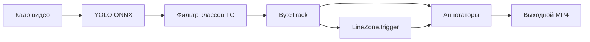

# Подсчёт транспортных средств по линии

Тестовое задание: детекция и трекинг ТС на видео с камеры видеонаблюдения, подсчёт пересечений линии в двух направлениях, визуализация результата.

## Технологии

| Компонент | Библиотека | Назначение |
|-----------|------------|------------|
| Детекция | [Ultralytics YOLOv8n](https://docs.ultralytics.com/integrations/onnx/) в формате **ONNX**, `imgsz: 1280` | Bounding box транспортных средств на CPU |
| Инференс | [ONNX Runtime](https://onnxruntime.ai/) | Ускорение инференса без GPU |
| Трекинг | [supervision](https://supervision.roboflow.com/) `ByteTrack` | Стабильные ID объектов между кадрами |
| Подсчёт | `sv.LineZone` | Пересечение линии: «к камере» / «от камеры» |
| Визуализация | `BoxAnnotator`, `TraceAnnotator`, `LabelAnnotator`, `LineZoneAnnotator` | Bbox, треки, счётчики на видео |
| UI | [Gradio](https://www.gradio.app/) | Загрузка видео, задание линии, просмотр результата |

Референс по логике подсчёта: [Count Objects Crossing the Line — Supervision](https://supervision.roboflow.com/develop/notebooks/count-objects-crossing-the-line/).

## Логика решения



1. **Детекция** — предобученная YOLOv8n (COCO). Оставляем классы: car (2), motorcycle (3), bus (5), truck (7).
2. **Трекинг** — `ByteTrack` присваивает `tracker_id` каждому ТС.
3. **Линия** — задаётся двумя точками `(x, y)` в координатах кадра (origin — левый верхний угол). `LineZone.trigger()` увеличивает `in_count` или `out_count` при пересечении.
4. **Направления** — в supervision «in/out» задаются геометрией линии (вектор start → end), а не здравым смыслом «к камере». Если «к камере» считает уезжающих — включите `swap_directions: true` в конфиге или галочку в Gradio (по умолчанию **включена**): линия разворачивается, счётчики меняются местами.
5. **Визуализация** — на каждом кадре рисуются bbox, метки `#id класс confidence`, следы траекторий и линия со счётчиками. Подписи «к камере» / «от камеры» рисуются через PIL и шрифт DejaVu (стандартный `cv2.putText` кириллицу не отображает).

## Быстрый старт

### Требования

- Python 3.11+
- CPU (GPU не обязателен)

### Установка

```bash
python3 -m venv .venv
source .venv/bin/activate   # Windows: .venv\Scripts\activate
pip install -r requirements.txt
```

**ONNX скачивается/собирается сам** при первом запуске (`src/app.py` или CLI): если `model_path` из конфига нет или `imgsz` не совпадает с ONNX — модель экспортируется автоматически (логи в терминал). Имя файла задаёт веса: `models/yolov8n.onnx` → `yolov8n.pt`.

Принудительный пересбор (опционально):

```bash
python scripts/export_onnx.py
```

### Gradio UI (основной способ)

```bash
python src/app.py
```

Откройте http://localhost:7860

1. Загрузите MP4 (например, [видео с Яндекс.Диска](https://disk.yandex.ru/i/C--D0n6IZH1rQA)).
2. На превью первого кадра **кликните дважды** — начало и конец линии подсчёта.
3. Нажмите **Запустить обработку**.
4. Смотрите результат: видео с аннотациями и таблицу счётчиков.

### Быстрая проверка (smoke test)

```bash
python scripts/validate_smoke.py
```

Нужен файл [`data/test_video.mp4`](data/test_video.mp4). Берёт 2-секундный фрагмент (`data/short.mp4`, создаётся через ffmpeg).

### CLI (отладка)

Вход по умолчанию — `data/test_video.mp4`. Настройте линию в `config/default.yaml`:

```yaml
line:
  start: [0, 540]
  end: [1920, 540]
```

```bash
python -m src.main --config config/default.yaml
```

Результат: `output/result.mp4` и `output/result.json` со счётчиками.

### Docker

Нужен `data/test_video.mp4`. Доступ к демону (один раз после `apt install docker.io`):

```bash
sudo usermod -aG docker "$USER"
# перелогиньтесь или: newgrp docker
```

Сборка и smoke:

```bash
bash scripts/docker_verify.sh
```

UI (если установлен compose: `docker compose` или `docker-compose`):

```bash
docker compose up --build
# альтернатива без compose:
docker build -t vehicle-counter .
docker run --rm -p 7860:7860 \
  -v "$(pwd)/storage:/app/storage" \
  -v "$(pwd)/models:/app/models" \
  -v "$(pwd)/config:/app/config" \
  -v "$(pwd)/data:/app/data" \
  vehicle-counter python src/app.py
```

Без прав на `docker.sock`: `sudo DOCKER="docker" bash scripts/docker_verify.sh`

UI: http://localhost:7860

## Структура проекта

```
├── config/default.yaml   # все настройки (см. таблицу выше)
├── models/*.onnx         # ONNX (создаётся автоматически)
├── scripts/export_onnx.py  # принудительный пересбор ONNX
├── src/
│   ├── app.py            # Gradio UI
│   ├── main.py           # CLI
│   ├── pipeline.py       # CV-пайплайн
│   ├── model_loader.py   # автоэкспорт ONNX при старте
│   ├── config.py
│   ├── cyrillic_draw.py
│   └── gradio_utils.py
├── storage/outputs/      # результаты из UI (gitignore)
├── Dockerfile
└── docker-compose.yml
```

## Настройки (`config/default.yaml`)

Все параметры по умолчанию — в [`config/default.yaml`](config/default.yaml). CLI: `--config путь/к/файлу.yaml`.

| Параметр | Сейчас | Описание |
|----------|--------|----------|
| `source_video` | `data/test_video.mp4` | Входное видео для CLI |
| `target_video` | `output/result.mp4` | Выходное видео и `{имя}.json` со счётчиками (CLI) |
| `model_path` | `models/yolov8n.onnx` | Путь к ONNX. Нет файла или другой `imgsz` внутри ONNX — **автоэкспорт** из `{имя}.pt` (см. `src/model_loader.py`) |
| `confidence` | `0.25` | Порог уверенности детектора (ниже — больше bbox, больше шума) |
| `iou` | `0.45` | Порог NMS: пересечение bbox для подавления дублей |
| `imgsz` | `1280` | Размер стороны кадра на вход YOLO. Для 4K важнее качество; `640` быстрее, но хуже на дальних машинах |
| `vehicle_class_ids` | `[2, 3, 5, 7]` | COCO: car, motorcycle, bus, truck |
| `line.start` / `line.end` | `[0, 540]` → `[1920, 540]` | Линия подсчёта для CLI (пиксели, origin — левый верх). В Gradio линия задаётся кликами |
| `labels.in` | `"к камере"` | Подпись счётчика `in_count` на видео и в UI |
| `labels.out` | `"от камеры"` | Подпись счётчика `out_count` |
| `swap_directions` | `true` | Развернуть линию (start↔end), если supervision считает наоборот относительно «к камере» |
| `annotators.box_thickness` | `4` | Толщина bbox и треков |
| `annotators.trace_length` | `30` | Длина следа траектории (кадров) |
| `gradio.server_name` | `0.0.0.0` | Адрес Gradio (`0.0.0.0` — доступ с других машин в сети) |
| `gradio.server_port` | `7860` | Порт веб-интерфейса |

**Смена модели:** в `model_path` укажите, например, `models/yolov8s.onnx` и при необходимости `imgsz: 1280` — при следующем запуске веса скачаются и соберутся в ONNX сами.

**Линия в Gradio:** в конфиге `line` для UI не используется — только два клика по превью кадра.

## Производительность на CPU

Сейчас в конфиге: **yolov8n** + ONNX + **`imgsz: 1280`** — относительно быстрая модель, но инференс на увеличенном разрешении (лучше видны дальние машины на 4K, дольше, чем `imgsz: 640`).

- Обработка длинного 4K-ролика может занять десятки минут; в UI есть прогресс.
- Быстрее: `imgsz: 640` в [`config/default.yaml`](config/default.yaml) — при несовпадении с ONNX модель пересоберётся автоматически.
- Точнее: `model_path: models/yolov8s.onnx` (или `yolov8m`) при том же `imgsz: 1280` — заметно медленнее на CPU.

### Бенчмарк (тестовое видео, yolov8n, ONNX Runtime, 24 потока)

Замеры на **5 минут** исходного ролика (один и тот же тестовый файл):

| `imgsz` | Время обработки | Примечание |
|---------|-----------------|------------|
| **1280** | **~580 с** (~9,7 мин) | ~1,9× длительности видео; выше детализация на дальних объектах |
| **640** | **~180 с** (~3 мин) | ~3,2× быстрее; на тестовом видео **качество детекции почти не пострадало** |

Вывод: для демо на CPU разумный компромисс — **`imgsz: 640`** с `yolov8n`, если на вашем ракурсе хватает качества. Для сложных сцен (мелкие машины вдали) — оставить **1280**.

Потоки: 24 — настройка ONNX Runtime / окружения (`OMP_NUM_THREADS` и т.п.); в коде проекта отдельно не задаётся.

## Ограничения

- Камера считается **статической**, ракурс не меняется.
- Линия задаётся **вручную** (в UI — двумя кликами).
- Один процесс Gradio обрабатывает одно видео за раз.

## Тестовое видео

Положите ролик в **`data/test_video.mp4`** (для тестового задания — [видео с Яндекс.Диска](https://disk.yandex.ru/i/C--D0n6IZH1rQA)).
